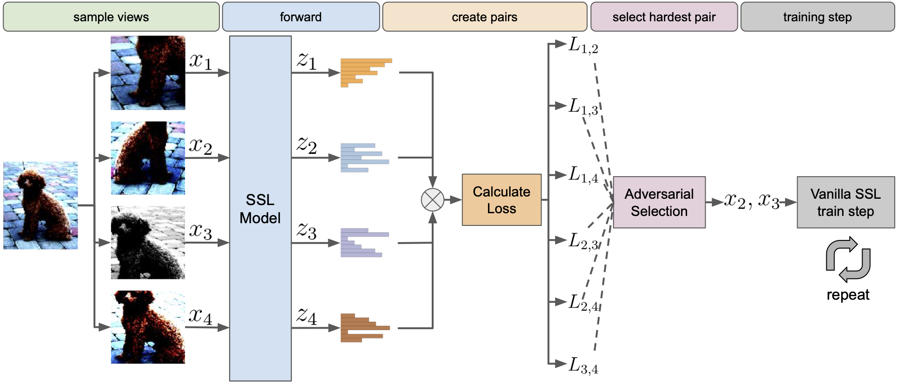

# Beyond Random Augmentations: <br> Pretraining with Hard Views (ICLR 2025)

Self-Supervised Learning (SSL) methods typically rely on random image augmentations, or views, to make models invariant to different transformations. We hypothesize that the efficacy of pretraining pipelines based on conventional random view sampling can be enhanced by explicitly selecting views that benefit the learning progress. A simple yet effective approach is to select hard views that yield a higher loss. In this paper, we propose Hard View Pretraining (HVP), a learning-free strategy that extends random view generation by exposing models to more challenging samples during SSL pretraining. HVP encompasses the following iterative steps: 1) randomly sample multiple views and forward each view through the pretrained model, 2) create pairs of two views and compute their loss, 3) adversarially select the pair yielding the highest loss according to the current model state, and 4) perform a backward pass with the selected pair. In contrast to existing hard view literature, we are the first to demonstrate hard view pretraining's effectiveness at scale, particularly training on the full ImageNet-1k dataset, and evaluating across multiple SSL methods, ConvNets, and ViTs. As a result, \MethodAbbr{} sets a new state-of-the-art on DINO ViT-B/16, reaching 78.8\% linear evaluation accuracy (a 0.6% improvement) and consistent gains of 1% for both 100 and 300 epoch pretraining, with similar improvements across transfer tasks in DINO, SimSiam, iBOT, and SimCLR.


## Examples sampled by HVP


Other branches are available here:
- [DINO branch](https://github.com/automl/hvp/tree/dino)
- [iBOT branch](https://github.com/automl/hvp/tree/ibot)
- [SimSiam Branch (main)](https://github.com/automl/hvp/)
- [SimCLR Branch](https://github.com/automl/hvp/tree/simclr)

## Setup:
```
conda env create -f environment.yaml
conda activate hvp
conda install -c conda-forge tensorboard
pip install omegaconf
```

## Download Model Files
(include pretraining, linear evaluation and finetuning checkpoints for both vanilla and hvp models)
- [DINO models](https://bit.ly/4dirXw1) (45G)
- [iBOT models](https://bit.ly/3WBEiGc) (11G)
- [SimSiam models](https://bit.ly/3WG2p5x) (20G)
- [SimCLR models](https://bit.ly/3LE64eL) (66G)

## Citation
Please acknowledge the usage of this code by citing the following publication:

```
@inproceedings{ferreira-iclr25a,
  title        = {Beyond Random Augmentations: Pretraining with Hard Views},
  author       = {F. Ferreira and I. Rapant and J. Franke and F. Hutter},
  booktitle    = {The Thirteenth International Conference on Learning Representations},
  year         = {2025},
  URL          = {https://iclr.cc/virtual/2025/poster/30639}
}
```
